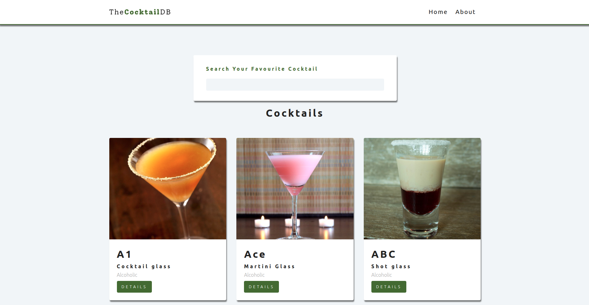
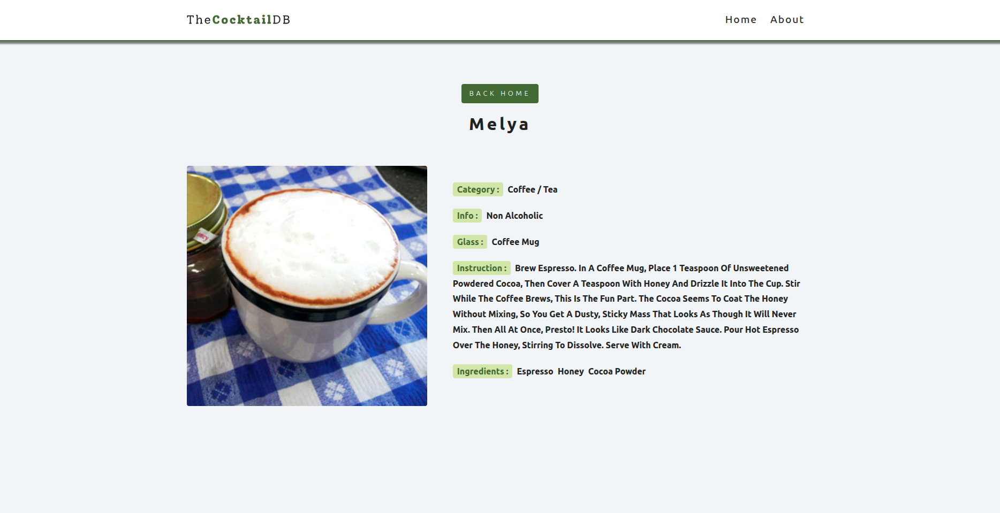
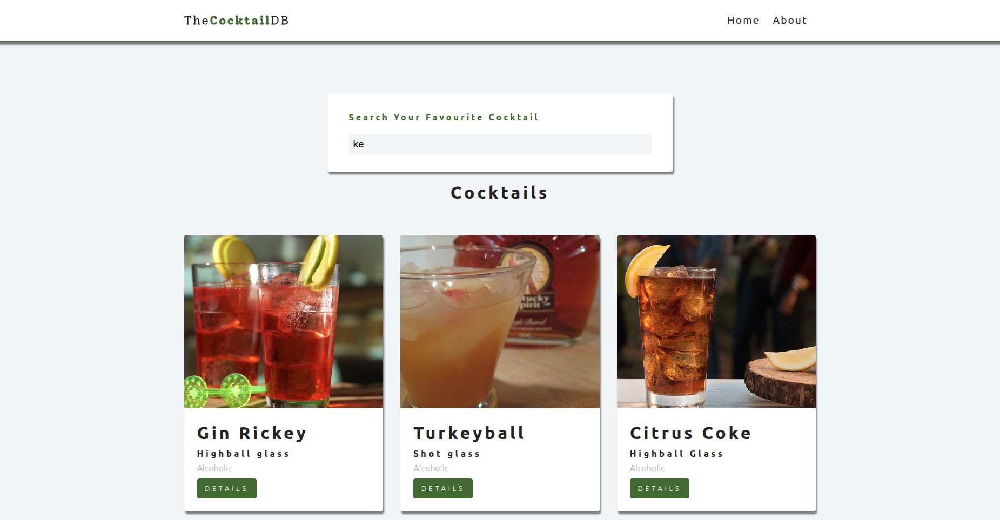

# React Cocktail App

A React application that lets users search and explore cocktail recipes using the [CocktailDB public API](https://www.thecocktaildb.com/api.php).

## Live Demo

[https://react-project-cocktails.netlify.app/](https://react-project-cocktails.netlify.app/)

## Table of Contents

- [React Cocktail App](#react-cocktail-app)
  - [Live Demo](#live-demo)
  - [Table of Contents](#table-of-contents)
  - [Features](#features)
  - [Tech Stack](#tech-stack)
  - [Project Structure](#project-structure)
  - [Getting Started](#getting-started)
    - [Prerequisites](#prerequisites)
    - [Installation](#installation)
    - [Running the App](#running-the-app)
  - [Available Scripts](#available-scripts)
  - [API Reference](#api-reference)
  - [Component Overview](#component-overview)
    - [`Navbar`](#navbar)
    - [`SearchForm`](#searchform)
    - [`CocktailList`](#cocktaillist)
    - [`Cocktail`](#cocktail)
    - [`SingleCocktail`](#singlecocktail)
    - [`Loading`](#loading)
  - [Routing](#routing)
  - [State Management](#state-management)
  - [ScreenShots](#screenshots)
- [Author](#author)

## Features

- Search cocktails by name in real-time
- Browse a grid of cocktail cards with thumbnail, glass type, and alcohol info
- View detailed information for a single cocktail (ingredients, instructions, category)
- Loading spinner while data is being fetched
- 404 error page for unknown routes
- Fully responsive layout

## Tech Stack

| Technology          | Version |
| ------------------- | ------- |
| React               | 16.13.1 |
| React Router DOM    | 5.2.0   |
| React Scripts (CRA) | 4.0.1   |

## Project Structure

```
src/
├── App.js              # Root component — sets up Router and routes
├── context.js          # Global state via React Context API
├── index.js            # Entry point
├── index.css           # Global styles
├── components/
│   ├── Navbar.js       # Top navigation bar with logo and links
│   ├── SearchForm.js   # Controlled search input
│   ├── CocktailList.js # Renders the grid of cocktail cards
│   ├── Cocktail.js     # Single cocktail card
│   └── Loading.js      # Loading spinner
└── pages/
    ├── Home.js          # Search form + cocktail list
    ├── About.js         # About page
    ├── SingleCocktail.js# Detailed view of one cocktail
    └── Error.js         # 404 not found page
```

## Getting Started

### Prerequisites

- Node.js >= 12
- npm or yarn

### Installation

```bash
# Clone the repository
git clone https://github.com/your-username/React-Project-Cocktails.git
cd React-Project-Cocktails

# Install dependencies
npm install
```

### Running the App

```bash
npm start
```

The app will open at [http://localhost:3000](http://localhost:3000).

## Available Scripts

| Script          | Description                      |
| --------------- | -------------------------------- |
| `npm start`     | Runs the app in development mode |
| `npm run build` | Builds the app for production    |
| `npm test`      | Launches the test runner         |
| `npm run eject` | Ejects from CRA (irreversible)   |

> **Note:** The build script uses `CI= react-scripts build` to prevent CI environments from treating warnings as errors.

## API Reference

This project uses the free [TheCocktailDB API](https://www.thecocktaildb.com/api.php).

| Endpoint                                                           | Usage                         |
| ------------------------------------------------------------------ | ----------------------------- |
| `https://www.thecocktaildb.com/api/json/v1/1/search.php?s={query}` | Search cocktails by name      |
| `https://www.thecocktaildb.com/api/json/v1/1/lookup.php?i={id}`    | Fetch a single cocktail by ID |

No API key is required for the free tier.

## Component Overview

### `Navbar`

Renders the top navigation bar with a logo and links to the Home and About pages.

### `SearchForm`

Controlled input using `useRef`. Fires `setSearchTerm` from global context on every keystroke, triggering a new API fetch.

### `CocktailList`

Consumes `loading` and `cocktails` from global context. Shows `<Loading />` while fetching, a no-results message when the array is empty, or a grid of `<Cocktail />` cards.

### `Cocktail`

A presentational card displaying the cocktail image, name, glass type, and alcohol info, with a "details" link to the single cocktail page.

### `SingleCocktail`

Fetches full cocktail details by `id` (from URL params) independently of global context. Displays image, category, glass, instructions, and up to 5 ingredients.

### `Loading`

Simple spinner shown during any data fetch.

## Routing

| Path            | Component        | Description                   |
| --------------- | ---------------- | ----------------------------- |
| `/`             | `Home`           | Search form and cocktail grid |
| `/about`        | `About`          | About page                    |
| `/cocktail/:id` | `SingleCocktail` | Detailed cocktail view        |
| `*`             | `Error`          | 404 page for unmatched routes |

---

## State Management

Global state is managed with the **React Context API** in `src/context.js`.

| State        | Type      | Description                                       |
| ------------ | --------- | ------------------------------------------------- |
| `loading`    | `boolean` | Whether a fetch is in progress                    |
| `searchTerm` | `string`  | Current search query (default: `"a"`)             |
| `cocktails`  | `array`   | Transformed list of cocktail objects from the API |

The `fetchDrinks` function is memoized with `useCallback` and re-runs whenever `searchTerm` changes.

The `useGlobalContext` custom hook provides convenient access to the context in any component:

```js
import { useGlobalContext } from '../context';

const { loading, cocktails, setSearchTerm } = useGlobalContext();
```

## ScreenShots







# Author

- Rezoan Shakil Prince
- Senior Software Engineer, BJIT Ltd
